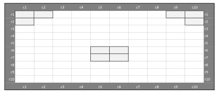

# Introduction



Imagine you're tasked with optimizing seating arrangements for a major event venue during a pandemic. You need to balance safety with efficiency, ensuring groups can enjoy the event while maintaining proper distancing.

Your challenge is to:

1. Place different-sized groups strategically
2. Maintain safe distances between all attendees
3. Maximize either revenue or total attendance
4. Work around venue constraints and blocked seats

## The Venue Layout
Here is the venue's seating arrangement - the same one we used in the lecture:

{fig-alt="Each white square represents an available seat, while grey squares are blocked"}

## Group Types and Their Characteristics

We have different types of groups wanting to attend the event:

- Singles (Type 'a'): Solo attendees
- Couples (Types 'b' and 'c'): Two people traveling together
- Small families (Types 'd' and 'e'): Groups of four
- Large families (Types 'f' and 'g'): Groups of six

Each group type has:

- A different ticket value (score)
- Limited availability (how many such groups want tickets)
- Space requirements (how many consecutive seats they need)

As we approach the end of the course, we'll remove some previous "guardrails" to give you more freedom in solving the problem.

:::{.callout-tip}

Don't worry if you cannot solve everything by yourself. Try your best and ask for help if you need it!

:::

---

# 1. Implement the Model

First, define all necessary sets, parameters, and variables to model the problem in Julia. The seating area layout is shown below:

{fig-alt="Each white square represents an available seat, while grey squares are blocked"}

## Seating Constraints

The following constraints must be maintained:

- Minimum one empty seat between groups
- One empty seat between rows
- One empty seat diagonally
- Maximum two groups per row
- Grey seats are obstacles and cannot be used

:::{.callout-important}
## Common Pitfalls
Watch out for the edge cases when implementing distancing constraints - especially around blocked seats! Also make sure that a group cannot start so far to the right that it would stick out beyond the last column - fix these variables to zero.
:::

---

## Define the Model

::: {.callout-note}
The groups are given **differently than in the lecture**! Either adjust the data or the model, depending on what you think is easier.
:::

::: {.content-visible when-profile="solutions"}
```{julia}
using JuMP
using HiGHS

# Model
arena_model = Model(HiGHS.Optimizer)

# Sets
row_set = 1:10
col_set = 1:10

# Group data
groups = [
    "a",
    "b",
    "c",
    "d",
    "e",
    "f",
    "g"]
req_seats = Dict(
    "a" => 1,
    "b" => 2,
    "c" => 2,
    "d" => 4,
    "e" => 4,
    "f" => 6,
    "g" => 6)
scores = Dict(
    "a" => 1,
    "b" => 2,
    "c" => 4,
    "d" => 4,
    "e" => 5,
    "f" => 6,
    "g" => 12)
availability = Dict(
    "a" => 3,
    "b" => 2,
    "c" => 3,
    "d" => 5,
    "e" => 2,
    "f" => 1,
    "g" => 1)

# Blocked seats (coordinates [row, column])
blocked_seats = [
    (1, 1),(1, 2),(1,9),(1,10),
    (2, 1),(2, 10),
    (6, 5),(6,6),
    (7, 5),(7,6),
]

# Parameters
h = 1  # horizontal safety distance
b = 1  # vertical safety distance
p = 2  # max groups per row (the lecture uses p_r per row; we use one value for all rows)

# Variables
@variable(arena_model, x[groups, row_set, col_set], Bin)

# Objective
@objective(arena_model, Max,
    sum(scores[g] * x[g,r,c] for g in groups, r in row_set, c in col_set))

# Constraints
# A group cannot start where it would stick out beyond the last column
# (this mirrors the set of feasible starting seats from the lecture)
@constraint(arena_model, [g in groups, r in row_set,
    c in col_set; c > maximum(col_set) - req_seats[g] + 1],
    x[g,r,c] == 0)

# Each group type is assigned at most as often as it is available
# (this differs from the lecture, where each group exists exactly once)
@constraint(arena_model, [g in groups],
    sum(x[g,r,c] for r in row_set, c in col_set) <= availability[g])

# Maximum groups per row
@constraint(arena_model, [r in row_set],
    sum(x[g,r,c] for g in groups, c in col_set) <= p)

# Horizontal and vertical social distancing
@constraint(arena_model, [r in row_set, c in col_set],
    sum(x[g,rr,cc] for g in groups,
        rr in max(1,r-b):r,
        cc in max(1,c-req_seats[g]+1-h):c) <= 1)

# Constraints to prevent assignments to blocked seats
@constraint(arena_model, [g in groups, (r,c) in blocked_seats],
    sum(x[g,r,cc] for cc in max(1,c-req_seats[g]+1):c) == 0)

# Solve the model
set_silent(arena_model)  # suppress the solver log
optimize!(arena_model)

# Check the results
println("Termination status: ", termination_status(arena_model))
println("Total score: ", round(Int, objective_value(arena_model)))
seats_revenue = round(Int, sum(req_seats[g] * value(x[g,r,c])
    for g in groups, r in row_set, c in col_set))
println("Seats in use: ", seats_revenue)
```
:::

::: {.content-visible unless-profile="solutions"}

```{julia}
#| output: false
#| eval: false
using JuMP
using HiGHS

# Model
arena_model = Model(HiGHS.Optimizer)

# Sets
row_set = 1:10
col_set = 1:10

# Group data
groups = [
    "a",
    "b",
    "c",
    "d",
    "e",
    "f",
    "g"]
req_seats = Dict(
    "a" => 1,
    "b" => 2,
    "c" => 2,
    "d" => 4,
    "e" => 4,
    "f" => 6,
    "g" => 6)
scores = Dict(
    "a" => 1,
    "b" => 2,
    "c" => 4,
    "d" => 4,
    "e" => 5,
    "f" => 6,
    "g" => 12)
availability = Dict(
    "a" => 3,
    "b" => 2,
    "c" => 3,
    "d" => 5,
    "e" => 2,
    "f" => 1,
    "g" => 1)

# Blocked seats (coordinates [row, column])
blocked_seats = [
    (1, 1),(1, 2),(1,9),(1,10),
    (2, 1),(2, 10),
    (6, 5),(6,6),
    (7, 5),(7,6),
]

# Variables
@variable(arena_model, x[groups, row_set, col_set], Bin)

# YOUR CODE BELOW

# Suggested structure:
# 1. Create parameters
# 2. Set objective function
# 3. Add constraints
# 4. Solve the model

```
:::

---

## Visualization

To test your solution, visualize it with a plot in Julia. The visualization is a great tool to [check if your solution is correct]{.highlight}. Your first model will likely run without errors and yet still violate some seating rule - the plot makes such violations easy to spot, as they are marked with a [red cross]{.highlight}. [If everything works from the start, great!]{.highlight}

::: {.content-visible when-profile="solutions"}
```{julia}
using Plots

# Create visualization of the solution
function visualize_seating(model)
    # Determine which group covers each seat
    seat_owner = fill("", length(row_set), length(col_set))
    violations = Tuple{Int,Int}[]
    for g in groups, r in row_set, c in col_set
        if value(model[:x][g,r,c]) > 0.5  # Using 0.5 to handle floating point
            for cc in c:(c+req_seats[g]-1)
                if cc > maximum(col_set)
                    # Group sticks out beyond the last column
                    push!(violations, (r, maximum(col_set)))
                    break
                elseif (r,cc) in blocked_seats || seat_owner[r,cc] != ""
                    # Group covers a blocked seat or overlaps another group
                    push!(violations, (r, cc))
                else
                    seat_owner[r,cc] = g
                end
            end
        end
    end

    # Create color mapping for groups
    color_map = Dict(
        "a" => :blue,
        "b" => :green,
        "c" => :red,
        "d" => :purple,
        "e" => :orange,
        "f" => :yellow,
        "g" => :pink
    )

    # Create plot
    plt = plot(
        aspect_ratio=:equal,
        xlims=(0.5,10.5),
        ylims=(0.5,10.5),
        yflip=true,  # Flip y-axis to match traditional seating layout
        legend=:outerright
    )

    # Plot empty and blocked seats
    for r in row_set, c in col_set
        if seat_owner[r,c] == ""
            is_blocked = (r,c) in blocked_seats
            scatter!(plt, [c], [r],
                    color=is_blocked ? :gray : :white,
                    markersize=10,
                    markershape=:square,
                    label=nothing)
        end
    end

    # Plot occupied seats with one legend entry per group type
    shown_groups = String[]
    for r in row_set, c in col_set
        g = seat_owner[r,c]
        if g != ""
            scatter!(plt, [c], [r],
                    color=color_map[g],
                    markersize=10,
                    markershape=:square,
                    label=g in shown_groups ? nothing : g)
            push!(shown_groups, g)
        end
    end

    # Mark constraint violations in a loud color instead of hiding them
    for (r,c) in violations
        scatter!(plt, [c], [r],
                color=:red,
                markersize=8,
                markershape=:x,
                label=nothing)
    end

    title!(plt, "Arena Seating Layout")
    xlabel!(plt, "Column")
    ylabel!(plt, "Row")

    return plt
end

# Display the visualization
plt = visualize_seating(arena_model)
display(plt)
```
:::

::: {.content-visible unless-profile="solutions"}
```{julia}
#| eval: false
using Plots

# Create visualization of the solution
function visualize_seating(model)
    # Determine which group covers each seat
    seat_owner = fill("", length(row_set), length(col_set))
    violations = Tuple{Int,Int}[]
    for g in groups, r in row_set, c in col_set
        if value(model[:x][g,r,c]) > 0.5  # Using 0.5 to handle floating point
            for cc in c:(c+req_seats[g]-1)
                if cc > maximum(col_set)
                    # Group sticks out beyond the last column
                    push!(violations, (r, maximum(col_set)))
                    break
                elseif (r,cc) in blocked_seats || seat_owner[r,cc] != ""
                    # Group covers a blocked seat or overlaps another group
                    push!(violations, (r, cc))
                else
                    seat_owner[r,cc] = g
                end
            end
        end
    end

    # Create color mapping for groups
    color_map = Dict(
        "a" => :blue,
        "b" => :green,
        "c" => :red,
        "d" => :purple,
        "e" => :orange,
        "f" => :yellow,
        "g" => :pink
    )

    # Create plot
    plt = plot(
        aspect_ratio=:equal,
        xlims=(0.5,10.5),
        ylims=(0.5,10.5),
        yflip=true,  # Flip y-axis to match traditional seating layout
        legend=:outerright
    )

    # Plot empty and blocked seats
    for r in row_set, c in col_set
        if seat_owner[r,c] == ""
            is_blocked = (r,c) in blocked_seats
            scatter!(plt, [c], [r],
                    color=is_blocked ? :gray : :white,
                    markersize=10,
                    markershape=:square,
                    label=nothing)
        end
    end

    # Plot occupied seats with one legend entry per group type
    shown_groups = String[]
    for r in row_set, c in col_set
        g = seat_owner[r,c]
        if g != ""
            scatter!(plt, [c], [r],
                    color=color_map[g],
                    markersize=10,
                    markershape=:square,
                    label=g in shown_groups ? nothing : g)
            push!(shown_groups, g)
        end
    end

    # Mark constraint violations in a loud color instead of hiding them
    for (r,c) in violations
        scatter!(plt, [c], [r],
                color=:red,
                markersize=8,
                markershape=:x,
                label=nothing)
    end

    title!(plt, "Arena Seating Layout")
    xlabel!(plt, "Column")
    ylabel!(plt, "Row")

    return plt
end

# Display the visualization
plt = visualize_seating(arena_model)
display(plt)
```
:::

If you encounter any difficulties and cannot solve the problem, please document your issues here:

```{julia}
#=


=#
```

---

# 2. Maximize the number of seats in use

Now let's explore a different optimization objective! Instead of focusing on revenue, imagine you're trying to accommodate as many people as possible at your venue - perhaps for a community event where maximizing attendance is more important than maximizing profit.

:::{.callout-tip}
Think about how this changes your objective function. What matters now is not the score per group, but how many seats each group occupies!
:::

Which group types do you expect to gain or lose seats under the new objective? Compare the values per seat of the different group types before you solve the model!

:::{.callout-warning}
Store the number of occupied seats from the first task in a variable **before** you change the objective. Once you re-optimize `arena_model`, the first solution is gone!
:::

Try implementing this new objective while keeping all the safety constraints in place.

::: {.content-visible when-profile="solutions"}
```{julia}
# Change the objective: every occupied seat now counts equally
@objective(arena_model, Max,
    sum(req_seats[g] * x[g,r,c] for g in groups, r in row_set, c in col_set))

# Solve the model again
optimize!(arena_model)

# Check the results
println("Termination status: ", termination_status(arena_model))
seats_attendance = round(Int, objective_value(arena_model))
println("Seats in use: ", seats_attendance)
println("Total score: ", round(Int, sum(scores[g] * value(x[g,r,c])
    for g in groups, r in row_set, c in col_set)))
```
:::

::: {.content-visible unless-profile="solutions"}
```{julia}
#| eval: false
# YOUR CODE BELOW

```
:::

Check if your solution is correct by visualizing it with the `visualize_seating` function below.

::: {.content-visible when-profile="solutions"}
```{julia}
plt = visualize_seating(arena_model)
display(plt)
```
:::

::: {.content-visible unless-profile="solutions"}
```{julia}
#| eval: false
# YOUR CODE BELOW

```
:::

How many more seats are in use when compared to the previous solution? Write a short code that calculates and prints the difference.

::: {.content-visible when-profile="solutions"}
```{julia}
println("Difference: ", seats_attendance - seats_revenue,
    " (", seats_revenue, " seats before, ", seats_attendance, " seats now)")
```
:::

::: {.content-visible unless-profile="solutions"}
```{julia}
#| eval: false
# YOUR CODE BELOW

```
:::

---


