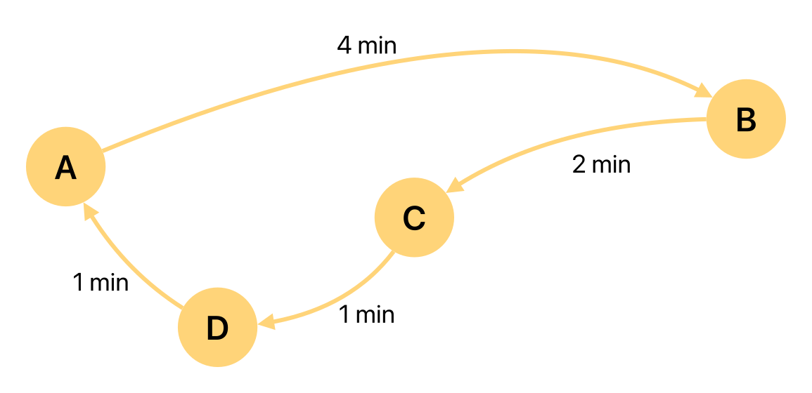
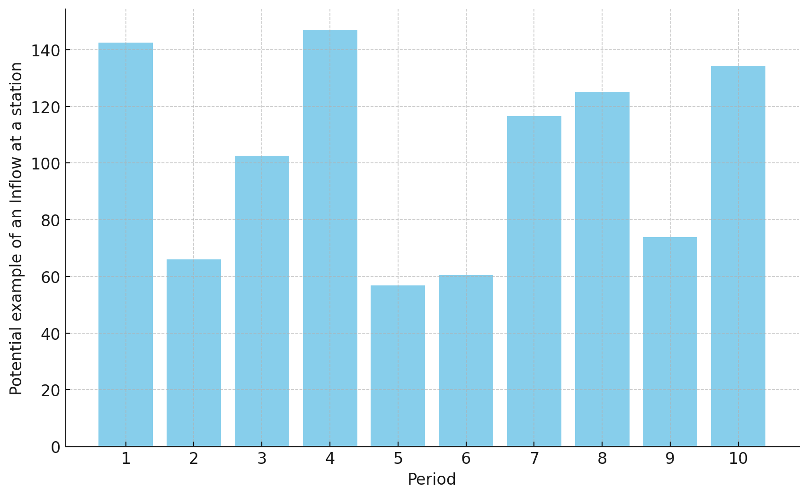
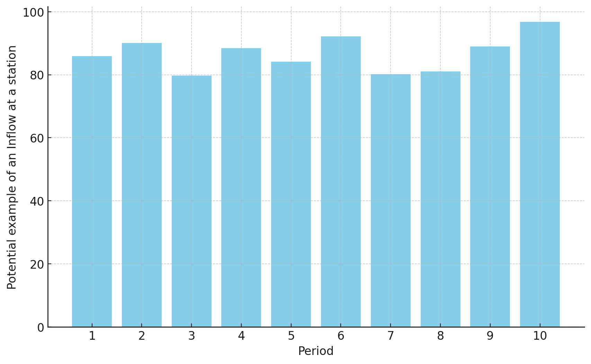
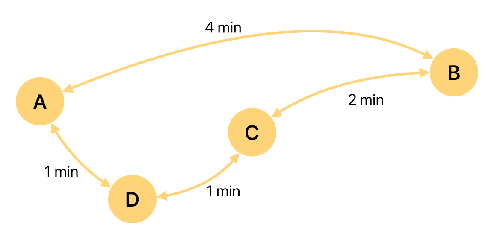

# Introduction



{fig-alt="Circular unidirectional metro line with four stations A, B, C, D. Travel times: A to B 4 minutes, B to C 2 minutes, C to D 1 minute, D to A 1 minute."}

Consider the depicted 'Golden Line' with 4 different stations A, B, C, D. For an upcoming timeframe of **10 minutes divided into 10 periods**, the transportation demand is going to exceed the available capacity of the network and each origin-destination pair will be requested by at least 1 passenger in every minute. **To handle the inflow, queues will be put in place at each metro station.**

# The Challenge

Your task is to **minimize the queues** without exceeding the available transport capacity of **max. 100 passengers per minute on each arc**. A safety buffer per arc is not needed. Each station layout is excellent, with sufficient stairs and escalators. Thus, the station itself is fully capable of handling any inflow that may result from the optimized restricted inflow. Nonetheless, queues are still necessary as the arcs cannot handle the full inflow.

# Recap: The Set $\mathcal{R}_{e,t}$

Recall the set from the lecture that maps station inflows to arc utilizations:

$$
\mathcal{R}_{e,t} = \{(o,d,p) \mid o,d \in \mathcal{O}, p \in \mathcal{P}, q_{o,d,p} > 0, e \in \mathcal{C}_{o,d}, t-\tau_{o,e} \in I_p\}
$$

It contains all combinations $(o,d,p)$ of origin $o$, destination $d$, and period $p$ whose passengers enter arc $e$ in minute $t$. Here, $\mathcal{C}_{o,d}$ is the set of arcs on the shortest path from $o$ to $d$, and $\tau_{o,e}$ is the travel time from station $o$ to the entry of arc $e$ along that path. In this tutorial, the period length is $m = 1$: each period is exactly one minute, so the last condition simplifies to $p = t - \tau_{o,e}$.

For example, a passenger entering station B in period 4 with destination A travels over B→C (2 min) and C→D (1 min) and thus enters arc (D,A) in minute $4 + 3 = 7$. Hence, $(B,A,4) \in \mathcal{R}_{(D,A),7}$.

# 1. Flow Analysis

Suppose we are in minute 7 at the arc of (D,A). Which inflows from which stations are going to impact the flow into the arc in this minute?

Write out the set $\mathcal{R}_{(D,A),7}$ and **briefly explain** your answer. You can write out the set in a comment, for example like this:

```julia
#=
{(A,B,1), (B,C,1), (C,D,1)}
=#
```

::: {.callout-tip}
To solve this task, it might be helpful to work with paper and pen to sketch the problem.
:::

::: {.content-visible when-profile="solutions"}
```{julia}
#=
YOUR ANSWER BELOW
{
    (D,A,7),
    (C,A,6),
    (B,A,4),
    (D,B,7),
    (D,C,7),
    (C,B,6),
}
=#
```

:::

::: {.content-visible unless-profile="solutions"}

```{julia}
#=
YOUR ANSWER BELOW


=#
```
:::

# 2. Inflow Control

:::: {.columns}

::: {.column width="50%"}
{fig-alt="Bar chart of allowed inflow per period with large jumps between consecutive periods."}
:::

::: {.column width="50%"}
{fig-alt="Bar chart of allowed inflow per period where the level changes only gradually between consecutive periods."}
:::

::::

As there is a rather large fluctuation of allowed inflow between periods, you are asked to introduce new constraints for the model. In the first period, the inflow at each station is supposed to be unrestricted. Thereafter, it is allowed to change by at most 20 persons up or down per period at each station.

Can you write out the decision variables and the additional constraints for the model as JuMP constraints?

::: {.callout-tip}
You don't need to solve the model or define the objective function. You just need to constrain the fluctuations and add the appropriate variables.
:::

::: {.content-visible when-profile="solutions"}
```{julia}
#| eval: false
using JuMP
metro_model = Model()

# YOUR CODE BELOW
set_stations = [:A, :B, :C, :D]
set_periods = 1:10
@variable(metro_model, X[o in set_stations, p in set_periods] >= 0)
@constraint(metro_model, upper_bound[o in set_stations, p in set_periods; p > 1], X[o, p] - X[o, p-1] <= 20)
@constraint(metro_model, lower_bound[o in set_stations, p in set_periods; p > 1], X[o, p] - X[o, p-1] >= -20)
```
:::

::: {.content-visible unless-profile="solutions"}
```{julia}
#| eval: false
using JuMP
metro_model = Model()

# YOUR CODE BELOW


```
:::

# 3. Bidirectional Flow

{fig-alt="Circular bidirectional metro network with four stations A, B, C, D. Travel times per direction: A and B 4 minutes, B and C 2 minutes, C and D 1 minute, D and A 1 minute."}

The metro was improved and there is now the possibility to travel in both directions. How would this change the set $\mathcal{R}_{(D,A),7}$ from 1.?

Write out the new set $\mathcal{R}_{(D,A),7}$ manually and briefly explain your answer.

::: {.content-visible when-profile="solutions"}
```{julia}
#=
# YOUR ANSWER BELOW
{
    (C, A, 6),
    (D, A, 7)
}
If we account for the fact that some paths have identical travel times, the answer depends on how these ties are broken. Exactly one extra entry can appear: (B,A,4), as the direct trip B->A takes 4 minutes, the same as the path B->C->D->A over arc (D,A).
=#
```
:::

::: {.content-visible unless-profile="solutions"}
```{julia}
#=
# YOUR ANSWER BELOW

=#
```
:::

# 4. Capacity Analysis

Although the system is bidirectional now, the **overall number of trains of the metro provider has not changed**. Would the change from a unidirectional metro system to a bidirectional metro system decrease the likelihood of crowd accidents due to insufficient arc-capacities?

Please explain your answer in a few sentences.

::: {.content-visible when-profile="solutions"}
```{julia}
#=
# YOUR ANSWER BELOW
That really depends on the actual demand for the different OD-pairs. Two effects
work against each other: with an unchanged fleet now split over both directions,
the capacity per directed arc roughly halves. At the same time, the shortest
paths become much shorter: the total travel time over all 12 OD-pairs drops from
48 arc-minutes (unidirectional) to 26 arc-minutes (bidirectional), a reduction
of almost 50%. Under uniform demand this is therefore roughly a wash, and the
demand pattern breaks the tie: we can find cases where the bidirectional flow is
better and cases where the unidirectional flow is better.
=#
```
:::

::: {.content-visible unless-profile="solutions"}
```{julia}
#=
# YOUR ANSWER BELOW

=#
```
:::

# 5. Computing the Set $\mathcal{R}_{e,t}$

Can you compute the set $\mathcal{R}_{e,t}$ for the unidirectional flow? Generate a dictionary $R$ that contains $|\mathcal{E}| \times |\mathcal{T}| = 4 \times 10 = 40$ entries. Each entry $\mathcal{R}_{e,t}$ should contain a vector with all origin-destination pairs and the corresponding time period saved as a tuple. Use the results to check your answer from the first task.

::: {.callout-note}
This task is a bit of a challenge. But as it is the last tutorial, I figured that's fine.
:::

::: {.content-visible when-profile="solutions"}
```{julia}
# YOUR CODE BELOW
# Solution for unidirectional flow
R = Dict()

Minutes = 1:10
Stations = [:A, :B, :C, :D]
OD_pairs = [(o, d) for o in Stations, d in Stations if o != d]
Arcs = [(:A, :B), (:B, :C), (:C, :D), (:D, :A)]

dist_dict = Dict(
    (:A, :B) => 4,
    (:B, :C) => 2,
    (:C, :D) => 1,
    (:D, :A) => 1
)

# Define paths for each origin-destination pair
paths = Dict(
    (:A, :B) => [(:A, :B)],
    (:A, :C) => [(:A, :B), (:B, :C)],
    (:A, :D) => [(:A, :B), (:B, :C), (:C, :D)],
    (:B, :C) => [(:B, :C)],
    (:B, :D) => [(:B, :C), (:C, :D)],
    (:B, :A) => [(:B, :C), (:C, :D), (:D, :A)],
    (:C, :D) => [(:C, :D)],
    (:C, :A) => [(:C, :D), (:D, :A)],
    (:C, :B) => [(:C, :D), (:D, :A), (:A, :B)],
    (:D, :A) => [(:D, :A)],
    (:D, :B) => [(:D, :A), (:A, :B)],
    (:D, :C) => [(:D, :A), (:A, :B), (:B, :C)]
)

# Calculate total travel time for each OD pair
travel_times = Dict()
for (od_pair, path) in paths
    travel_times[od_pair] = sum(dist_dict[arc] for arc in path)
end
for station in Stations
    travel_times[(station, station)] = 0
end

# Display the travel times
for (od_pair, time) in travel_times
    println("Time from $(od_pair[1]) to $(od_pair[2]): $time minutes")
end

# Populate R with tuples (o, d, p) based on the given conditions
# Note: every OD pair has queued passengers in every minute (see the
# introduction), so we can skip the q > 0 condition from the lecture here.
for e in Arcs
    for t in Minutes
        R[(e, t)] = [
            (o, d, t - travel_times[(o, e[1])])
            for (o, d) in OD_pairs
            if e in paths[(o, d)] && (t - travel_times[(o, e[1])]) in Minutes
        ]
    end
end

# Check the computed set against your manual answer from the first task
println("R[((:D, :A), 7)] = ", R[((:D, :A), 7)])
```

Does the printed entry match your answer from the first task?

```{julia}
# YOUR CODE BELOW
# Solution for bidirectional flow
R = Dict()

Minutes = 1:10
Stations = [:A, :B, :C, :D]
OD_pairs = [(o, d) for o in Stations, d in Stations if o != d]
Arcs = [
    (:A, :B),
    (:B, :C),
    (:C, :D),
    (:D, :A),
    (:B, :A),
    (:C, :B),
    (:D, :C),
    (:A, :D),
]

dist_dict = Dict(
    (:A, :B) => 4,
    (:B, :C) => 2,
    (:C, :D) => 1,
    (:D, :A) => 1,
    (:B, :A) => 4,
    (:C, :B) => 2,
    (:D, :C) => 1,
    (:A, :D) => 1
)

# Define paths for each shortest path origin-destination pair
paths = Dict(
    (:A, :B) => [(:A, :B)],
    (:A, :C) => [(:A, :D), (:D, :C)],
    (:A, :D) => [(:A, :D)],
    (:B, :C) => [(:B, :C)],
    (:B, :D) => [(:B, :C), (:C, :D)],
    (:B, :A) => [(:B, :A)],
    (:C, :D) => [(:C, :D)],
    (:C, :A) => [(:C, :D), (:D, :A)],
    (:C, :B) => [(:C, :B)],
    (:D, :A) => [(:D, :A)],
    (:D, :B) => [(:D, :C), (:C, :B)],
    (:D, :C) => [(:D, :C)]
)

# Calculate total travel time for each OD pair
travel_times = Dict()
for (od_pair, path) in paths
    travel_times[od_pair] = sum(dist_dict[arc] for arc in path)
end
for station in Stations
    travel_times[(station, station)] = 0
end

# Display the travel times
for (od_pair, time) in travel_times
    println("Time from $(od_pair[1]) to $(od_pair[2]): $time minutes")
end

# Populate R with tuples (o, d, p) based on the given conditions
for e in Arcs
    for t in Minutes
        R[(e, t)] = [
            (o, d, t - travel_times[(o, e[1])])
            for (o, d) in OD_pairs
            if e in paths[(o, d)] && (t - travel_times[(o, e[1])]) in Minutes
        ]
    end
end

# Check the computed set against your manual answer from the third task
println("R[((:D, :A), 7)] = ", R[((:D, :A), 7)])
```
:::

::: {.content-visible unless-profile="solutions"}
```{julia}
# YOUR CODE BELOW


```

If you encounter any difficulties and cannot solve the problem, please document your issues here:

```{julia}
#=


=#
```
:::

::: {.callout-note}
### From the set to the model
The dictionary `R` is exactly what the lecture's arc-capacity constraint iterates over:

$$
\sum_{(o,d,p) \in \mathcal{R}_{e,t}} X_{o,p} \times \frac{q_{o,d,p}}{\sum_{f \in \mathcal{O}} q_{o,f,p}} \leq c_e \quad \forall e \in \mathcal{E}, t \in \mathcal{T}
$$

With `R` computed and $c_e = 100$, adding this constraint and the queue-minimizing objective from the lecture completes the model behind "The Challenge". As no safety buffer is needed here, the factor $\alpha$ is left out.
:::

# 6. Bonus: Metro Flow Simulation (0.5 points)

Now, you can earn up to 0.5 additional bonus points by building a simulation of passenger flows through a metro network. The network consists of two lines with a shared transfer station T: line 1 runs A → B → T → E and line 2 runs C → D → T → F (see the `paths` dictionary below). Passengers enter at stations A, B, C, D and travel to various destinations.

First, study the network data below to understand the structure and then implement a minute-by-minute simulation that tracks the queues at entry stations, passenger flows through arcs and arc utilization over time. Then, visualize the results with some plots and try to implement inflow regulation to achieve a feasible solution (no arc exceeds capacity).


::: callout-tip
Good luck! This is really a tough task.
:::

```{julia}
#| eval: false

# Stations and arcs
stations = [:A, :B, :C, :D, :T, :E, :F]
entry_stations = [:A, :B, :C, :D]
arcs = [(:A, :B), (:B, :T), (:T, :E), (:C, :D), (:D, :T), (:T, :F)]

# Network parameters
travel_time = 1  # minutes per arc
arc_capacity = 90  # passengers per minute
n_minutes = 20  # total simulation time

# Inflow regulation: single constant rate per station (passengers/minute)
# Set to 1000 (no regulation) initially - experiment to find feasible values
inflow_rates = Dict(:A => 1000, :B => 1000, :C => 1000, :D => 1000)

# Paths for each OD pair
paths = Dict(
    (:A, :B) => [(:A, :B)],
    (:A, :E) => [(:A, :B), (:B, :T), (:T, :E)],
    (:A, :F) => [(:A, :B), (:B, :T), (:T, :F)],
    (:B, :E) => [(:B, :T), (:T, :E)],
    (:B, :F) => [(:B, :T), (:T, :F)],
    (:C, :D) => [(:C, :D)],
    (:C, :F) => [(:C, :D), (:D, :T), (:T, :F)],
    (:C, :E) => [(:C, :D), (:D, :T), (:T, :E)],
    (:D, :F) => [(:D, :T), (:T, :F)],
    (:D, :E) => [(:D, :T), (:T, :E)]
)

# Demand data: demand[period][(origin, destination)] = passengers
demand = Dict(
    1 => Dict((:A,:B)=>7,  (:A,:E)=>12, (:A,:F)=>5,  (:B,:E)=>15, (:B,:F)=>10,
              (:C,:D)=>5,  (:C,:F)=>10, (:C,:E)=>8,  (:D,:F)=>15, (:D,:E)=>12),
    2 => Dict((:A,:B)=>8,  (:A,:E)=>15, (:A,:F)=>10, (:B,:E)=>18, (:B,:F)=>15,
              (:C,:D)=>8,  (:C,:F)=>15, (:C,:E)=>10, (:D,:F)=>18, (:D,:E)=>15),
    3 => Dict((:A,:B)=>12, (:A,:E)=>22, (:A,:F)=>18, (:B,:E)=>28, (:B,:F)=>22,
              (:C,:D)=>12, (:C,:F)=>22, (:C,:E)=>15, (:D,:F)=>28, (:D,:E)=>18),
    4 => Dict((:A,:B)=>15, (:A,:E)=>28, (:A,:F)=>22, (:B,:E)=>32, (:B,:F)=>28,
              (:C,:D)=>15, (:C,:F)=>28, (:C,:E)=>27, (:D,:F)=>32, (:D,:E)=>22),
    5 => Dict((:A,:B)=>15, (:A,:E)=>28, (:A,:F)=>22, (:B,:E)=>32, (:B,:F)=>28,
              (:C,:D)=>15, (:C,:F)=>28, (:C,:E)=>18, (:D,:F)=>32, (:D,:E)=>22),
    6 => Dict((:A,:B)=>12, (:A,:E)=>22, (:A,:F)=>18, (:B,:E)=>22, (:B,:F)=>18,
              (:C,:D)=>12, (:C,:F)=>22, (:C,:E)=>15, (:D,:F)=>22, (:D,:E)=>21),
    7 => Dict((:A,:B)=>8,  (:A,:E)=>15, (:A,:F)=>10, (:B,:E)=>18, (:B,:F)=>15,
              (:C,:D)=>8,  (:C,:F)=>15, (:C,:E)=>10, (:D,:F)=>18, (:D,:E)=>15),
    8 => Dict((:A,:B)=>5,  (:A,:E)=>10, (:A,:F)=>5,  (:B,:E)=>15, (:B,:F)=>10,
              (:C,:D)=>5,  (:C,:F)=>10, (:C,:E)=>5,  (:D,:F)=>15, (:D,:E)=>10)
)
```


